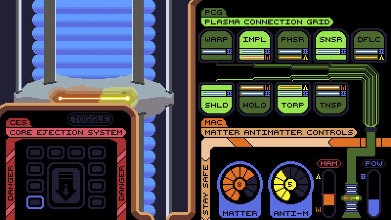

# Warp Core Engineer

A game about controlling a warp core on a space ship.  
Done in 3 days for the 49th Ludum Dare game jam in collaboration with [Akronsus](https://github.com/Akronsus)  

### Links
[Ludum Dare](https://ldjam.com/events/ludum-dare/49/warp-core-engineer)  
[itch.io](https://akronsus.itch.io/warp-core-engineer)

### Licenses
Code under MIT  
Sounds, sprites and art under CC BY-NC 4.0

### Credits 
Font Beef'd by Extram Studios
